# Mini projetos em C

Uma coleção de **13 programas de terminal em C17** para praticar lógica, repetição, vetores, estruturas de dados e arquivos. Cada projeto tem seu próprio `main.c` e pode ser compilado e executado separadamente.

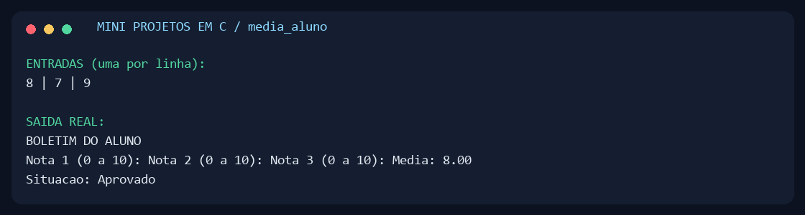

## O que tem no kit

| Tema | Projeto | O que você pratica |
| --- | --- | --- |
| Fundamentos | [Idade](projetos/01_fundamentos/idade/main.c) | Data do sistema e cálculo da idade que completa no ano |
| Fundamentos | [Porcentagem da turma](projetos/01_fundamentos/porcentagem_turma/main.c) | Proporções e tratamento de turma vazia |
| Fundamentos | [Média do aluno](projetos/01_fundamentos/media_aluno/main.c) | Três notas, média e classificação |
| Repetição | [Média de números](projetos/02_repeticao/media_numeros/main.c) | Acumuladores e sentinela `9999` |
| Repetição | [Contagem crescente](projetos/02_repeticao/contagem_crescente/main.c) | Números de 1 a 500, inclusive |
| Repetição | [Contagem decrescente](projetos/02_repeticao/contagem_decrescente/main.c) | Números de 1500 a 1, inclusive |
| Repetição | [Audiência de TV](projetos/02_repeticao/audiencia_tv/main.c) | Percentuais dos canais 4, 5, 7 e 12; canal `0` encerra |
| Vetores | [Busca binária](projetos/03_vetores/busca_binaria/main.c) | Pesquisa em até 100 valores ordenados |
| Vetores | [Comparador de preços](projetos/03_vetores/comparador_precos/main.c) | Matriz de 4 produtos × 8 lojas; ofertas abaixo de R$ 120 |
| Estruturas | [Pilha](projetos/04_estruturas/pilha/main.c) | LIFO: o último a entrar é o primeiro a sair |
| Estruturas | [Fila circular](projetos/04_estruturas/fila_circular/main.c) | FIFO e reutilização das posições do vetor |
| Arquivos | [Segmento binário](projetos/05_arquivos/segmento_binario/main.c) | `fwrite`, `fseek` e `fread` de um trecho de 10 inteiros |
| Arquivos | [Cadastro de vendas](projetos/05_arquivos/cadastro_vendas/main.c) | Cadastro, listagem, ordenação e persistência em CSV |

## Como executar

Você precisa de um compilador C com suporte a C17: GCC, Clang ou MSVC. Python 3 é necessário apenas para os scripts de compilação e verificação; CMake é uma alternativa opcional.

### Compilar um projeto com GCC ou Clang

Na raiz do repositório:

```sh
gcc -std=c17 -Wall -Wextra -Wpedantic -I include projetos/01_fundamentos/media_aluno/main.c -o media_aluno
```

No Windows, execute `./media_aluno.exe`; no Linux ou macOS, `./media_aluno`. Para usar Clang, substitua `gcc` por `clang`.

### Compilar o kit inteiro

```sh
python scripts/build.py
```

O script procura GCC, Clang ou MSVC no `PATH` e cria os executáveis em `build/bin/`. Também aceita `--cc clang`, `--cc gcc` ou o caminho do compilador. A compilação usa avisos rigorosos e trata avisos como erros.

No Windows com Visual Studio, abra o **Developer Command Prompt** e execute:

```bat
python scripts/build.py --cc cl
build\bin\media_aluno.exe
```

Para a instalação padrão do Visual Studio 2019 Build Tools, `scripts\build-msvc.cmd` configura o ambiente automaticamente.

No PowerShell, depois de compilar:

```powershell
.\build\bin\media_aluno.exe
.\build\bin\pilha.exe
.\build\bin\cadastro_vendas.exe
```

No Linux ou macOS:

```sh
./build/bin/media_aluno
./build/bin/pilha
./build/bin/cadastro_vendas
```

### Alternativa com CMake

```sh
cmake -S . -B build/cmake
cmake --build build/cmake --config Release
```

Os binários ficam em `build/cmake/bin/`; geradores com múltiplas configurações, como Visual Studio, acrescentam `Release/`. A verificação abaixo usa os binários de `scripts/build.py` em `build/bin/`.

## Entradas e regras

- Informe uma resposta por linha. Números decimais usam **ponto**, por exemplo `7.5`. Entradas inválidas solicitam uma nova resposta; o fim da entrada encerra o programa.
- A idade representa quantos anos a pessoa completa no ano atual; o exercício recebe somente o ano de nascimento.
- As notas vão de 0 a 10. Média ≥ 7 aprova; de 5 até abaixo de 7 indica recuperação; abaixo de 5 reprova.
- Na busca binária, digite os valores em ordem crescente, permitindo repetições. A posição exibida começa em 1; o índice começa em 0. Se houver duplicatas, uma ocorrência é retornada.
- Pilha e fila comportam 10 inteiros. Seus menus permitem inserir, remover, consultar, listar, esvaziar e sair.
- O cadastro comporta 50 produtos com código único e quantidade não negativa. Nomes aceitam espaços, até 63 bytes, e não aceitam `;`. A ordenação usa a comparação de bytes de `strcmp`.
- `vendas.csv` é salvo após cadastro ou ordenação e carregado na próxima execução. Um arquivo inválido interrompe a abertura, preservando seu conteúdo. A gravação substitui o arquivo diretamente; este é um exercício local, sem transações ou acesso simultâneo.
- `segmento_binario` cria ou substitui `numeros.dat`, grava os números de 0 a 29 e lê os índices de 10 a 19. O formato usa a representação nativa de `int`, portanto não é um formato de intercâmbio entre arquiteturas.

Os arquivos de dados são criados no **diretório de onde você executa o programa**, não necessariamente na pasta do executável. Execute o cadastro sempre no mesmo diretório para reutilizar seus dados.


### Fundamentos

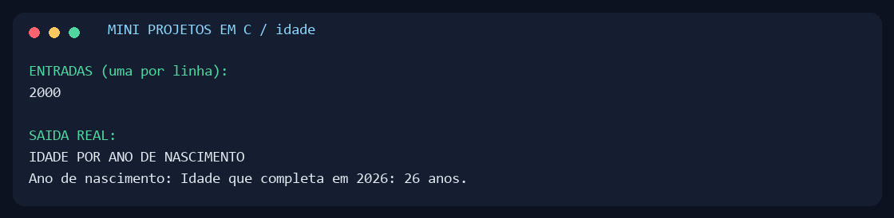
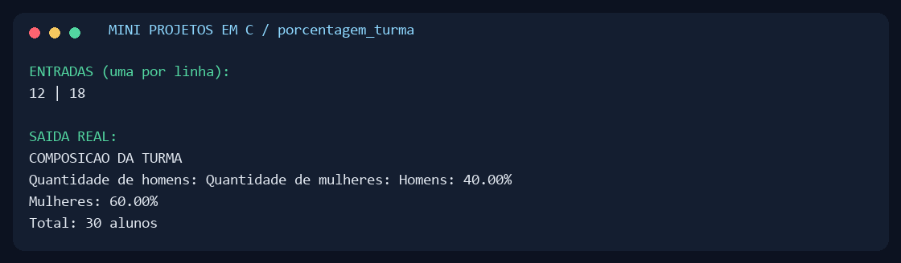

A captura do boletim está na abertura deste README.

### Repetição

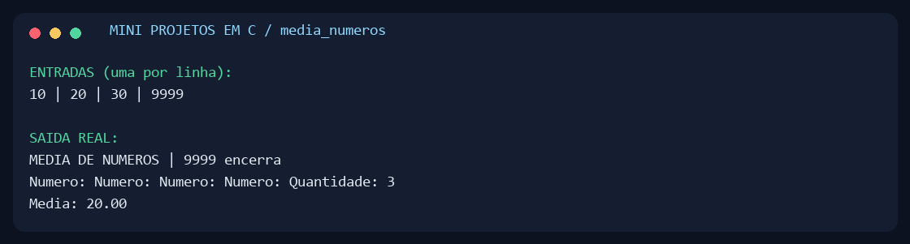
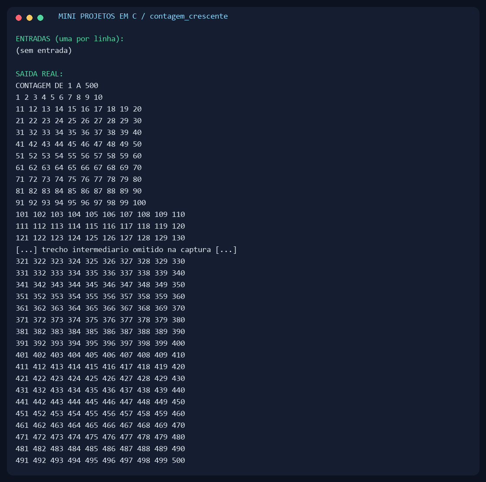
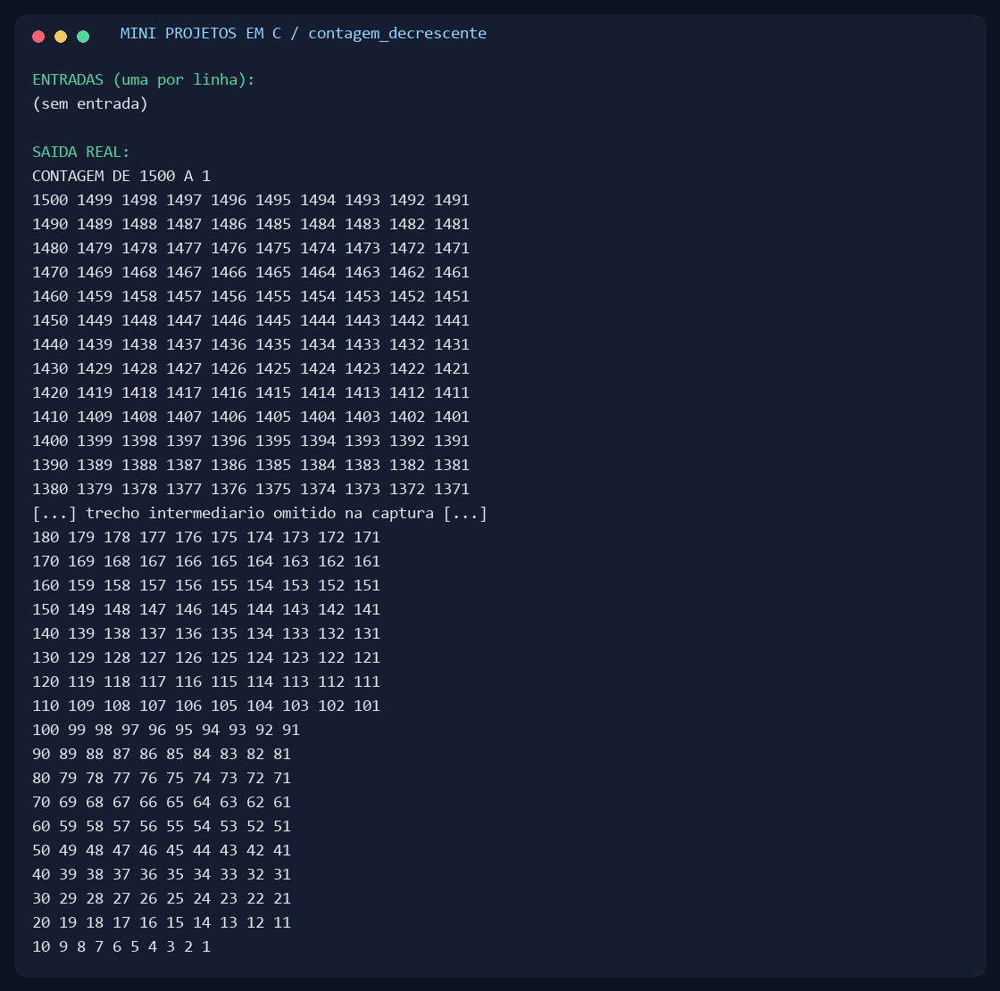
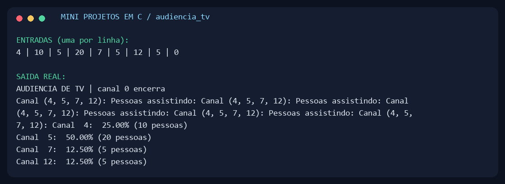

### Vetores e matrizes

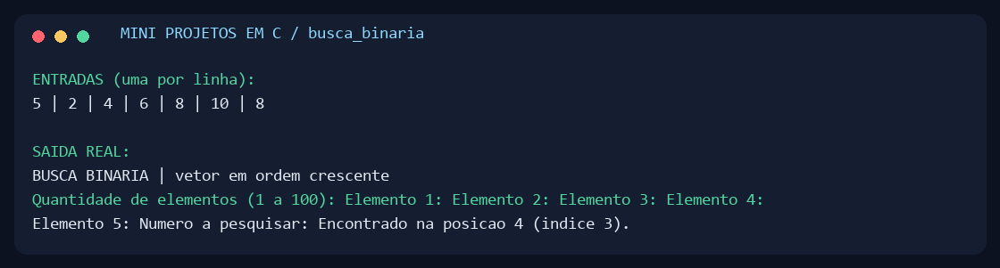
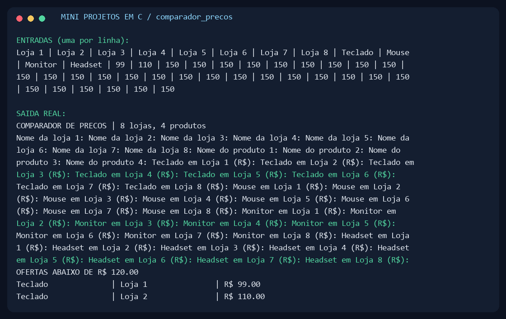

### Estruturas de dados

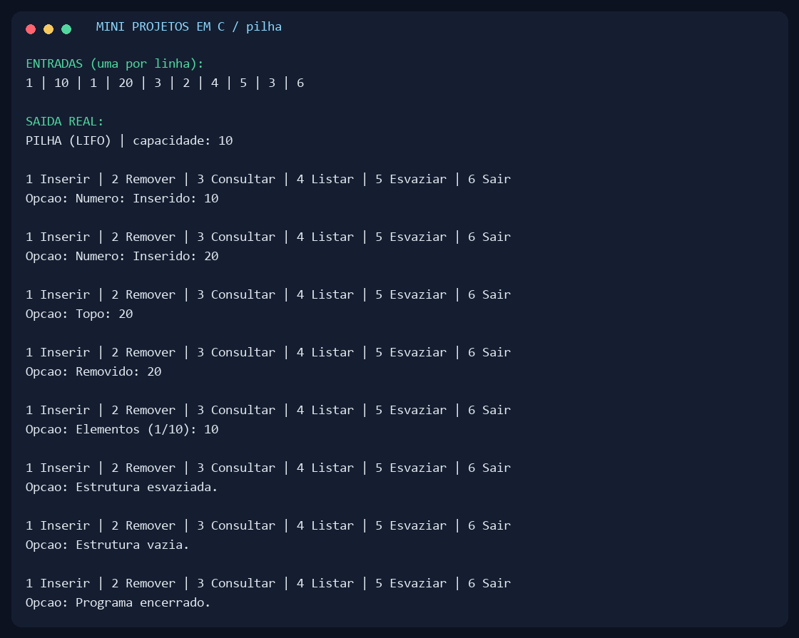
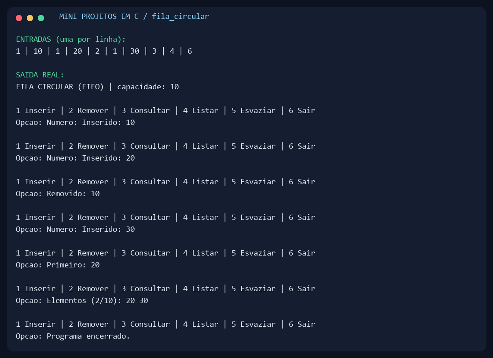

### Arquivos

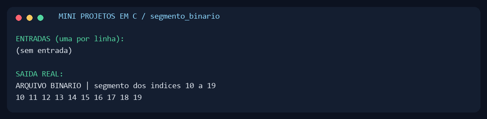
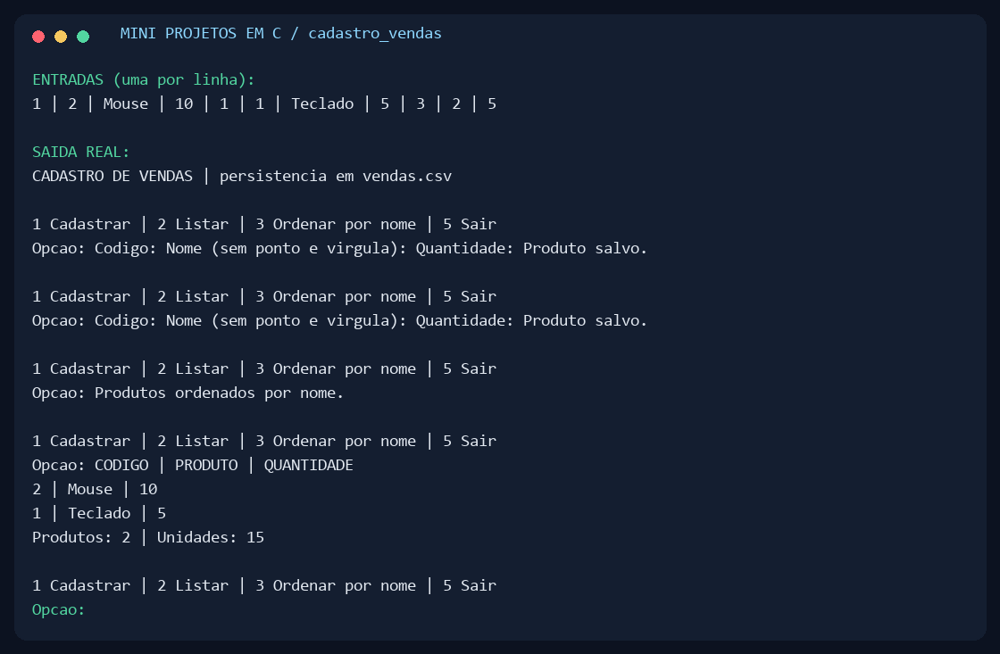

## Organização

```text
projetos/
  01_fundamentos/     Idade, porcentagens e boletim
  02_repeticao/       Contagens, média e audiência
  03_vetores/         Busca e comparação de preços
  04_estruturas/      Pilha e fila circular
  05_arquivos/        Binários e cadastro de vendas
include/             Leitura e validação compartilhadas
scripts/             Compilação, verificação e capturas
docs/capturas/        PNGs e transcrições das execuções
legado/              Arquivos originais preservados
```

